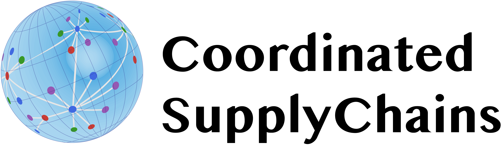

---

A supply chain modeling framework based on `JuMP` implementing the coordination model described described by [Tominac and Zavala](https://doi.org/10.1016/j.compchemeng.2020.107157). `CoordinatedSuppylChains.jl` automates this implementation; users can point it at a set of data files, and the package will build the model, solve it, save solution variables to .csv files, and create basic network plots of the system. For more control, users can call functions one-by-one, giving access to all intermediate data structures, or simply point a single convenient function at a directory with the required data files, and `CoordinatedSupplyChains` will do the rest. The present release supports steady-state and dynamic supply chain coordination problems, with the option to include environmental impact metrics.

| **Documentation**                                                               | **Build Status**                                                                                | **Citation** |
|:-------------------------------------------------------------------------------:|:-----------------------------------------------------------------------------------------------:|:--------------------------------------:|
|[](https://tominapa.github.io/CoordinatedSupplyChains.jl/dev)|[](https://github.com/Tominapa/CoordinatedSupplyChains.jl/actions)[](https://codecov.io/gh/Tominapa/CoordinatedSupplyChains.jl)|[](https://doi.org/10.1016/j.compchemeng.2020.107157)|

Coordination is a powerful market management system used in electrical grid management to determine the optimal set of transactions between buyers and sellers of electricity as well as the resulting prices. Electricity markets involve multiple competing stakeholders (multiple buyers and multiple sellers) and the coordination process ensures that market outcomes are in a state of equilibrium. Among other notable properties, the underlying coordination optimization model is linear, and provides information about electricity pricing through dual interpretations. `CoordinatedSupplyChains.jl` generalizes coordination to multi-product supply chains, including product transformation; i.e., products can change form within this framework. `CoordinatedSupplyChains.jl` uses an abstraction with four stakeholder classes: buyers, sellers, technology providers, and transportation providers. Every supply chain stakeholder falls into one of these classes, and the coordination procedure guarantees that each stakeholder participating in the market has a positive profit, so the package shows its utility in the analysis of multi-stakeholder supply chains, where there multiple independent entities (companies or individuals) making up a complex, interconnected supply chain.

## License
`CoordinatedSupplyChains.jl` is licensed under the [MIT "Expat" license](./LICENSE).

## Documentation

[](https://tominapa.github.io/CoordinatedSupplyChains.jl/dev)

Documentation includes an overview of the software, instructions for setting up the required data files, and guides that will help you get started.

## Citing

If `CoordinatedSupplyChains.jl` is useful in your research, we appreciate your citation to our work. This helps us promote new work and development on our code releases. We hope you find our code helpful, and thank you for any feedback you might have for us.

[](https://doi.org/10.1016/j.compchemeng.2020.107157)
```latex
@article{TominacZavala2020,
	title = {Economic properties of multi-product supply chains},
	journal ={Comput Chem Eng},
	pages = {107157},
	year = {2020},
	issn = {0098-1354},
	doi ={https://doi.org/10.1016/j.compchemeng.2020.10715},
	url = {http://www.sciencedirect.com/science/article/pii/S0098135420305810},
	author = {Philip A. Tominac and Victor M. Zavala}
}
```

[](https://doi.org/10.1016/j.compchemeng.2022.107666)
```latex
@article{TomacZhangZavala2022,
	title = {Spatio-temporal economic properties of multi-product supply chains},
	journal = {Comput Chem Eng},
	volume = {159},
	pages = {107666},
	year = {2022},
	issn = {0098-1354},
	doi = {https://doi.org/10.1016/j.compchemeng.2022.107666},
	url = {https://www.sciencedirect.com/science/article/pii/S0098135422000114},
	author = {Philip A. Tominac and Weiqi Zhang and Victor M. Zavala},
}
```

## Acknowledgements

We acknowledge support from the U.S. Department of Agriculture (grant 2017-67003-26055) and partial funding from the National Science Foundation (under grant CBET-1604374).